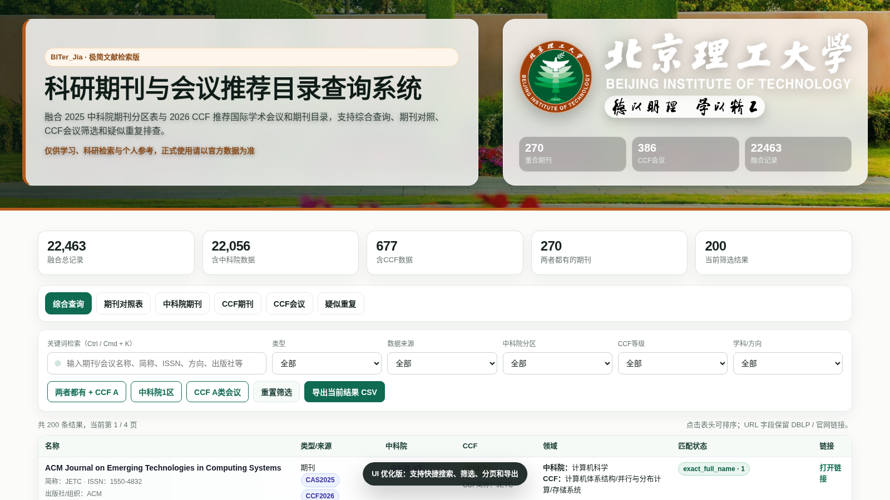
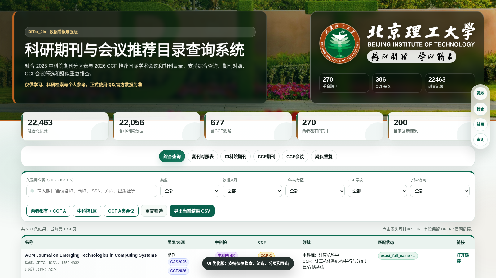
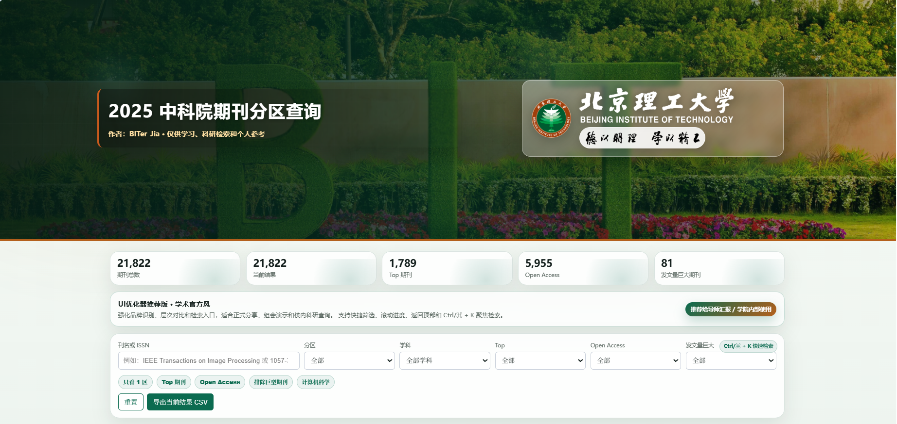
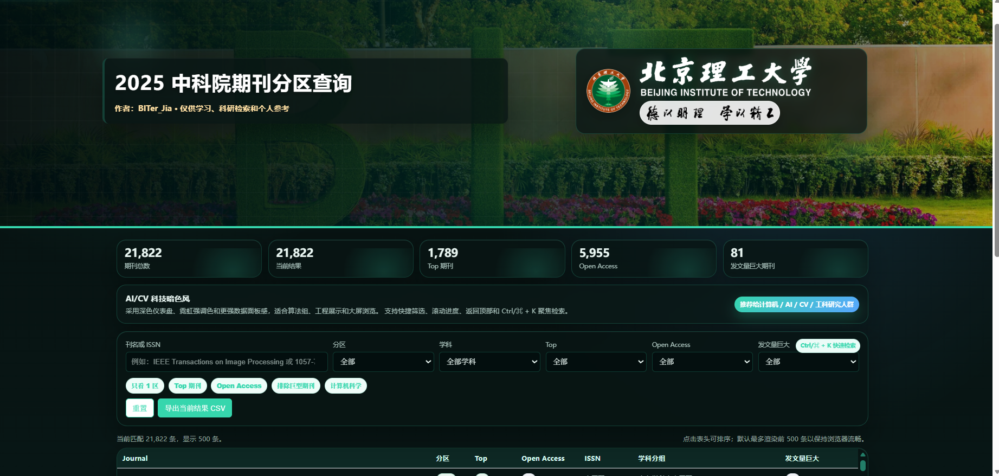
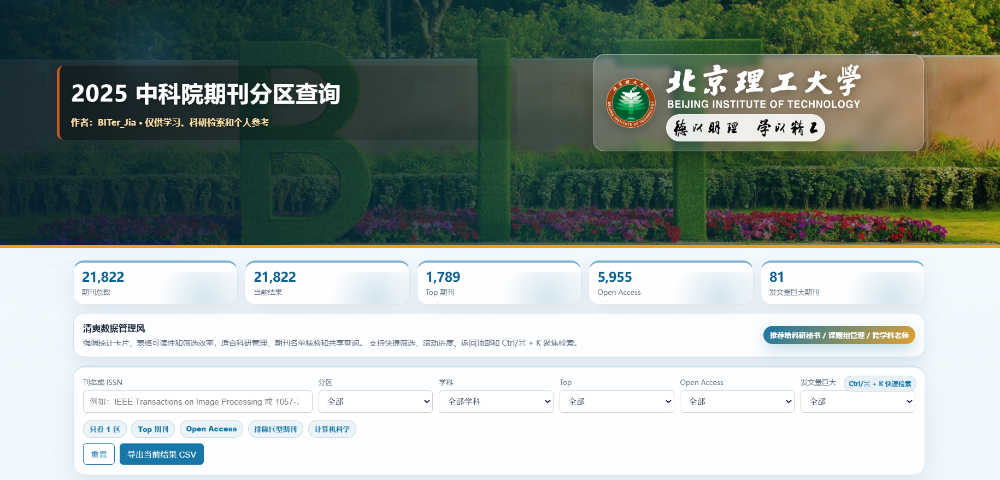

# 科研期刊与会议推荐目录查询系统 v2.0

一个面向研究生、科研人员、课题组和科研管理场景的 **科研期刊与会议推荐目录查询网页工具**。

本项目融合了：

- **2025 中科院期刊分区表**
- **2026 CCF 推荐国际学术会议和期刊目录**

支持期刊与会议的综合检索、中科院分区查询、CCF 等级查询、期刊对照、CCF 会议筛选、疑似重复项排查、结果导出等功能。

> 说明：本项目仅供学习、科研检索、论文调研和个人参考使用。正式投稿、毕业审核、职称评审、科研考核等场景，请以中科院官方数据、CCF 官方目录、期刊官网及所在单位科研管理部门要求为准。

---

## 在线访问

```text
https://github.com/xhgxtygf/Journal-Ranking-Search_BIT.git
```


---

## 项目预览

### 学术官方增强版


### AI / CV 科技暗色版


### 极简文献检索版



### 数据看板版



### 现代玻璃动态版


---

## v2.0 更新说明

相比早期版本，v2.0 主要升级如下：

- 从单一的“中科院期刊分区查询”升级为“中科院 × CCF 融合查询系统”
- 新增 CCF 推荐国际学术会议和期刊目录数据
- 新增期刊 / 会议统一检索
- 新增中科院与 CCF 期刊对照功能
- 新增 CCF 会议筛选功能
- 新增疑似重复项排查功能
- 新增多个 UI 优化版本
- 新增动态交互效果
- 新增底部可折叠版权声明与法律风险提示
- 优化 GitHub Pages 展示与社交媒体传播效果

---

## 项目定位

在科研过程中，研究生和科研人员经常需要快速判断：

- 某个期刊属于中科院几区？
- 是否为 TOP 期刊？
- 是否为 OA 期刊？
- 是否属于 CCF 推荐目录？
- CCF 等级是 A、B 还是 C？
- 某个方向有哪些 CCF 推荐会议？
- 某个期刊是否同时出现在中科院和 CCF 数据中？
- 投稿或组会调研时，如何快速整理候选期刊和会议？

本项目希望提供一个 **打开即用、无需后端、适合本地和 GitHub Pages 部署的静态网页查询工具**。

---

## 核心特点

- 纯前端 HTML / CSS / JavaScript 实现
- 不依赖后端服务器
- 不需要数据库环境
- 支持 GitHub Pages 静态部署
- 支持本地双击 HTML 文件直接使用
- 支持多条件筛选和关键词检索
- 支持导出当前筛选结果为 CSV
- 支持多个 UI 风格版本
- 适合科研调研、投稿初筛、组会汇报和课题组共享

---

## 数据融合说明

本项目不是简单地把两份数据追加到一起，而是进行了融合处理。

融合后的每条记录可以理解为：

```text
一个期刊或会议 = 一条主记录
中科院分区 = 一个评价字段
CCF 等级 = 另一个评价字段
```

对于同时出现在中科院和 CCF 数据中的期刊，会尽量合并为同一条记录，并同时展示：

```text
中科院分区 / TOP / OA / 大类学科
CCF 等级 / CCF 方向 / CCF 年份
```

对于 CCF 会议，则保留为会议记录，中科院字段为空。

---

## 主要功能

### 1. 综合查询

支持在同一个页面中检索：

- 中科院期刊
- CCF 期刊
- CCF 会议
- 两个数据源均包含的期刊
- 疑似重复记录

### 2. 关键词检索

支持通过以下字段快速检索：

- 期刊名称
- 会议名称
- 期刊简称
- 会议简称
- ISSN
- 出版社 / 组织
- 中科院学科
- CCF 方向
- DBLP / 官网链接

支持快捷键：

```text
Ctrl / Cmd + K
```

快速聚焦搜索框。

### 3. 多条件筛选

支持常用科研筛选条件：

- 类型筛选：期刊 / 会议
- 数据来源筛选：中科院 / CCF / 两者都有
- 中科院分区筛选：1 区 / 2 区 / 3 区 / 4 区
- CCF 等级筛选：A / B / C
- 学科与方向筛选
- TOP / OA 信息展示
- 疑似重复项查看

### 4. 期刊对照

项目支持查看同时出现在两类数据源中的期刊，便于判断：

```text
这个期刊是否既有中科院分区，又属于 CCF 推荐目录？
```

这一功能适合用于：

- 投稿期刊初筛
- 课题组期刊推荐
- 导师组会讨论
- 学术质量初步判断

### 5. CCF 会议查询

除期刊外，本项目还支持 CCF 推荐会议查询。

可以按照：

- CCF A 类会议
- CCF B 类会议
- CCF C 类会议
- 人工智能
- 计算机视觉 / 图形学 / 多媒体
- 数据库 / 数据挖掘 / 信息检索
- 网络与信息安全
- 软件工程
- 体系结构
- 人机交互
- 交叉 / 综合 / 新兴方向

进行筛选。

### 6. 结果导出

支持将当前筛选结果导出为 CSV 文件，便于后续进行：

- Excel 二次整理
- 投稿期刊列表制作
- 组会汇报材料整理
- 文献调研表构建
- 科研管理数据留档

---

## UI 版本说明

本项目提供多个 UI 优化版本，适合不同使用场景。

### 版本 1：BIT 学术官方增强版

文件名：

```text
UI_01_BIT_Official_Pro.html
```

适合场景：

- GitHub Pages 正式发布
- 导师汇报
- 学院内部展示
- 课题组公共查询工具
- 稳重正式的科研场景

设计特点：

- 北京理工大学视觉风格
- 顶部校园背景
- 校徽、校名、校训展示
- 信息层级清晰
- 适合公开展示

### 版本 2：AI / CV 科技暗色版

文件名：

```text
UI_02_AI_Cyber_Dark.html
```

适合场景：

- AI 实验室
- 计算机视觉方向
- 工科课题组
- 技术分享
- 大屏展示

设计特点：

- 深色科技风格
- 高对比信息面板
- 动态光效
- 更适合技术型科研人群

### 版本 3：极简文献检索版

文件名：

```text
UI_03_Minimal_Research.html
```

适合场景：

- 研究生日常查刊
- 论文调研
- 投稿初筛
- 个人本地使用

设计特点：

- 简洁克制
- 弱化装饰
- 强调检索效率
- 阅读压力小

### 版本 4：数据看板版

文件名：

```text
UI_04_Data_Dashboard.html
```

适合场景：

- 科研秘书
- 课题组数据管理
- 学科统计
- 横向项目资料整理
- 跨学科共享查询

设计特点：

- 看板式布局
- 统计信息突出
- 表格可读性强
- 适合长期维护和管理

### 版本 5：现代玻璃动态版

文件名：

```text
UI_05_Glass_Dynamic.html
```

适合场景：

- CSDN 展示
- 朋友圈分享
- 项目展示页
- 社交媒体传播
- 视觉效果展示

设计特点：

- 现代玻璃拟态
- 动态光斑
- 卡片动效
- 视觉传播效果更强

---

## 动态交互效果

部分 UI 版本加入了轻量级动态效果：

- 页面顶部滚动进度条
- 返回顶部按钮
- 统计数字滚动动画
- 卡片入场动画
- 表格行悬浮反馈
- 按钮水波纹效果
- 快捷筛选按钮
- 搜索框快捷聚焦
- 顶部背景动态光效
- 玻璃拟态和阴影层次

所有动态效果均使用原生 CSS / JavaScript 实现，不依赖 Vue、React 或后端框架。

---

## 使用方法

### 方法一：本地直接打开

下载项目后，双击任意 HTML 文件即可使用。

推荐优先打开：

```text
UI_01_BIT_Official_Pro.html
```

或者打开版本导航页：

```text
index.html
```

### 方法二：部署到 GitHub Pages

1. 创建一个 GitHub 仓库
2. 上传项目文件
3. 确保仓库根目录下存在 `index.html`
4. 进入仓库设置：

```text
Settings → Pages
```

5. 设置发布方式：

```text
Source: Deploy from a branch
Branch: main
Folder: / root
```

6. 保存后等待 GitHub Pages 自动部署

部署完成后，访问地址通常为：

```text
https://你的GitHub用户名.github.io/仓库名/
```

---

## 推荐项目结构

```text
Journal-Ranking-Search_BIT/
├── README.md
├── index.html
├── UI_01_BIT_Official_Pro.html
├── UI_02_AI_Cyber_Dark.html
├── UI_03_Minimal_Research.html
├── UI_04_Data_Dashboard.html
├── UI_05_Glass_Dynamic.html
└── assets/
    ├── preview_official_pro.png
    ├── preview_ai_cyber_dark.png
    ├── preview_minimal_research.png
    ├── preview_data_dashboard.png
    └── preview_glass_dynamic.png
```

---

## 是否需要 JSON 数据源？

当前生成的多个 HTML 版本大多为 **单文件版 HTML**。

也就是说：

```text
HTML 文件 = 页面结构 + 样式 + 查询逻辑 + 数据
```

因此，快速部署时不需要额外上传 `merged_venues_data.json`。

不过，如果后续你希望长期维护项目，可以改造成：

```text
index.html
data/merged_venues_data.json
```

这种结构的优点是：

- 更新数据时只需要替换 JSON
- HTML 页面更轻量
- 更适合长期维护
- 更适合多人协作

---

## 数据字段说明

融合数据中常见字段包括：

```text
id                记录编号
type              类型：期刊 / 会议
short_name        简称
full_name         全称
issn              ISSN
publisher         出版社或组织
url               DBLP 或官网链接

cas_zone          中科院分区
cas_fields        中科院学科
cas_top           是否 TOP
cas_oa            是否 OA
cas_is_mega       是否大类期刊
cas_mega_fields   大类学科信息

ccf_rank          CCF 等级
ccf_fields        CCF 方向
ccf_short_name    CCF 简称
ccf_year          CCF 目录年份

source_tags       数据来源标签
match_status      匹配状态
match_score       匹配相似度
duplicate_note    重复或合并说明
```

---

## 数据来源与免责声明

本项目使用的数据主要来自：

```text
2025 中科院期刊分区表
2026 CCF 推荐国际学术会议和期刊目录
```

重要说明：

- 本项目仅供学习、科研检索和个人参考
- 不代表任何官方机构立场
- 不保证数据完全准确、实时或无遗漏
- 不构成投稿建议、学术评价建议或科研管理依据
- 实际使用请以官方数据、期刊官网、学校或单位科研管理部门要求为准
- 若用于公开传播，请保留数据来源说明和免责声明

---

## 版权与使用声明

本项目为个人学习和科研辅助工具，主要用于提高期刊与会议目录查询效率。

请勿将本项目用于：

- 商业售卖
- 数据倒卖
- 伪造官方查询平台
- 替代正式科研管理系统
- 误导性学术评价或投稿推荐

如需二次修改、公开分享或课题组内部使用，请保留：

```text
数据来源说明
仅供学习与科研检索参考
正式使用以官方数据为准
免责声明
```

---

## 法律风险提示

由于期刊分区、会议推荐目录、评价标准等信息可能涉及版权、数据使用权限和官方解释权，本项目使用者应自行承担数据核验责任。

本项目作者不对以下情况负责：

- 数据滞后导致的判断错误
- 期刊分区变动
- CCF 目录更新
- 学校或单位认定标准差异
- 投稿、毕业、职称、项目申报等结果影响
- 因二次传播或商业使用引发的争议

---

## 后续优化方向

后续可以继续扩展：

- 增加期刊收藏功能
- 增加投稿备注字段
- 增加本地 JSON 数据导入
- 增加期刊 / 会议对比功能
- 增加 JCR、影响因子、预警期刊等字段
- 增加移动端专项适配
- 增加暗色 / 亮色主题切换
- 增加数据更新日志
- 改造成 HTML + JSON 分离版本
- 增加模糊匹配和别名检索能力

---

## 适用人群

本项目适合：

- 硕士研究生
- 博士研究生
- 青年教师
- 科研助理
- 课题组负责人
- 科研秘书
- 论文投稿前期调研人员
- 需要快速查询期刊分区和 CCF 推荐目录的科研工作者

---

## License

本项目仅供学习、科研辅助和非商业使用。

如需公开传播、二次修改或用于组织内部平台，请保留原始数据来源说明、项目说明和免责声明。

# 2025 中科院期刊分区查询网页

一个面向科研人员、研究生和课题组使用的 **2025 中科院期刊分区查询 HTML 网页工具**。  
项目支持期刊关键词检索、学科筛选、分区筛选、TOP 期刊筛选、综述期刊筛选、排序、结果导出等功能，并针对不同科研使用场景设计了多套 UI 风格版本。

> 说明：本项目仅供学习、科研检索和个人参考使用，实际期刊分区信息请以中科院官方发布数据及相关权威平台为准。
>
## 学术官方风



## AI / CV 科技暗色风



## 极简文献检索风


## 清爽数据管理风



---

## 项目定位

在日常科研中，研究生和科研人员经常需要快速判断某个期刊的大致分区、学科归属、是否为 TOP 期刊、是否综述类期刊等信息。

本项目的目标是做一个：

- 打开即用的本地 HTML 查询工具
- 不依赖后端服务器
- 适合科研人员快速检索
- 适合课题组内部共享
- 适合进一步二次开发和 UI 改造

---

## 主要功能

### 1. 期刊快速检索

支持按照以下字段进行关键词查询：

- 期刊名称
- ISSN
- 学科方向
- 分区信息
- 是否 TOP
- 是否综述

---

### 2. 多条件筛选

支持常用科研检索筛选条件：

- 大类学科筛选
- 小类学科筛选
- 中科院分区筛选
- TOP 期刊筛选
- 综述期刊筛选
- 结果排序

---

### 3. 数据统计展示

页面顶部提供统计卡片，用于快速了解数据整体情况，例如：

- 总期刊数量
- 不同分区数量
- TOP 期刊数量
- 综述期刊数量
- 当前筛选结果数量

---

### 4. 结果导出

支持将当前筛选结果导出为 CSV 文件，便于后续进行：

- 投稿期刊整理
- 组会汇报
- 论文调研表格制作
- Excel 二次分析

---

## UI 版本说明

本项目根据不同科研使用人群和使用场景，设计了多种 HTML UI 版本。

### 版本 1：学术官方风

适合场景：

- 导师汇报
- 学院内部分享
- 正式科研查询
- 课题组公共工具

设计特点：

- 稳重、正式
- 北京理工大学视觉元素
- 适合公开展示
- 信息层级清晰

---

### 版本 2：AI / CV 科技暗色风

适合场景：

- 计算机视觉方向
- AI 实验室
- 工科课题组
- 大屏展示
- 技术分享页面

设计特点：

- 深色科技风
- 动态光效
- 高对比信息面板
- 更适合技术型科研人群

---

### 版本 3：极简文献检索风

适合场景：

- 研究生日常查刊
- 快速论文调研
- 投稿初筛
- 个人本地使用

设计特点：

- 干净简洁
- 弱化装饰
- 强调搜索效率
- 阅读压力小

---

### 版本 4：清爽数据管理风

适合场景：

- 科研秘书
- 课题组数据管理
- 横向课题资料整理
- 跨学科老师共享使用

设计特点：

- 明亮清爽
- 表格可读性强
- 管理后台风格
- 适合长期维护

---

## 动态交互优化

页面加入了一些轻量级动态元素，以提升用户体验：

- 顶部滚动进度条
- 返回顶部按钮
- 统计卡片悬浮动效
- 表格行悬浮反馈
- 快捷筛选按钮
- `Ctrl / Cmd + K` 快速聚焦搜索框
- 顶部背景轻微动态光效
- 页面元素入场动效

所有动态效果均为前端 CSS / JavaScript 实现，不依赖复杂框架。

---

## 使用方法

### 方法一：直接打开 HTML

下载项目后，直接双击对应的 `.html` 文件即可使用。

```text
BIT_Journal_UI_01_Official_Academic.html
BIT_Journal_UI_02_AI_CV_Tech_Dark.html
BIT_Journal_UI_03_Minimal_Literature_Search.html
BIT_Journal_UI_04_Data_Admin_Light.html
